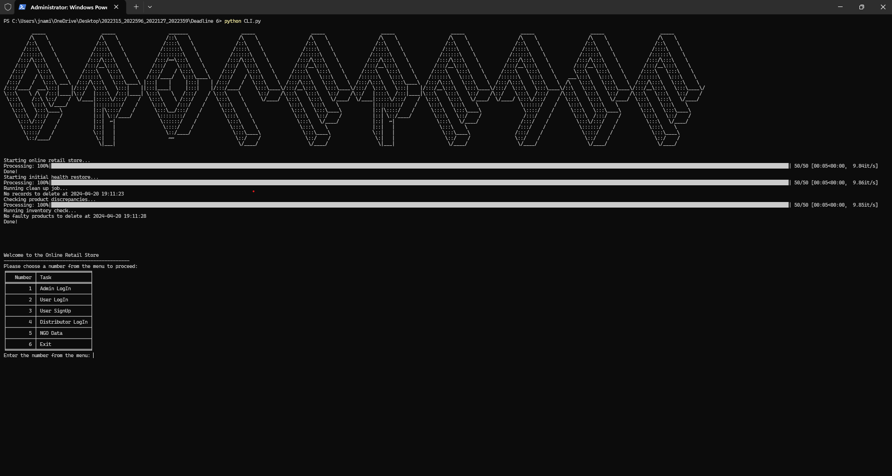
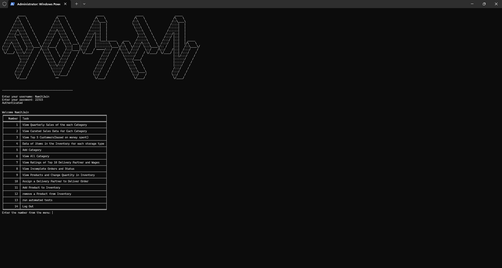
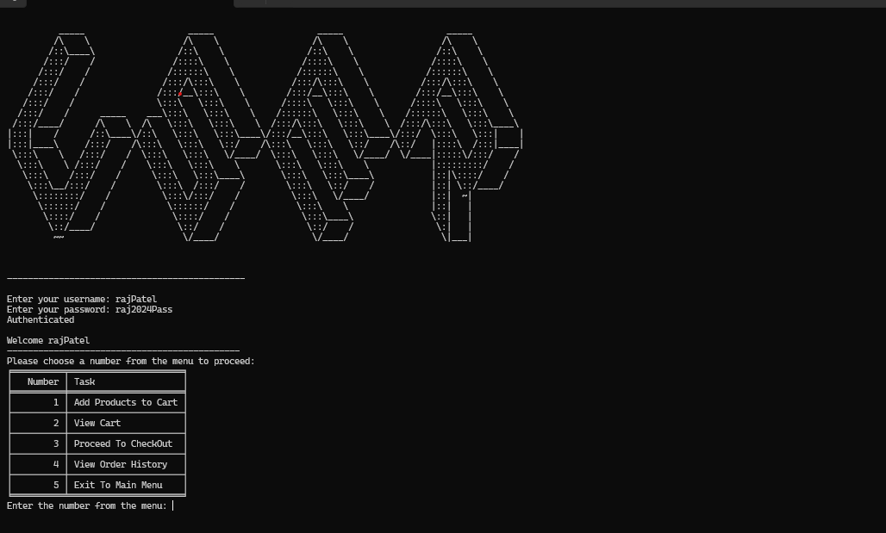
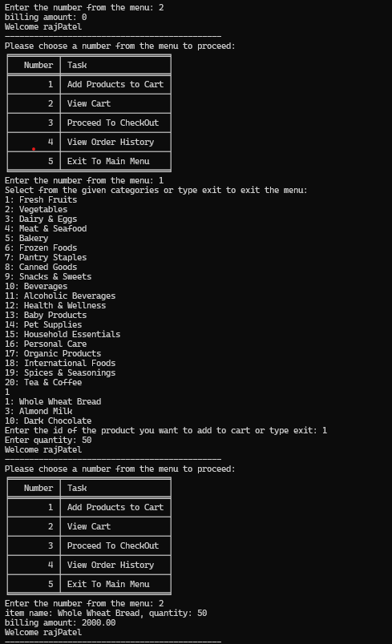
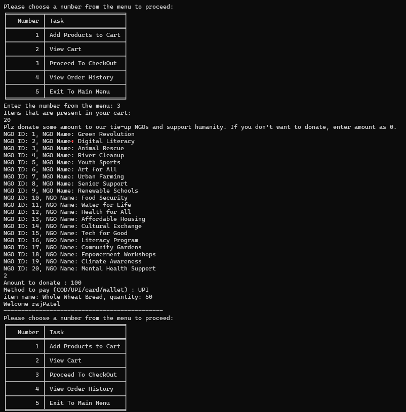
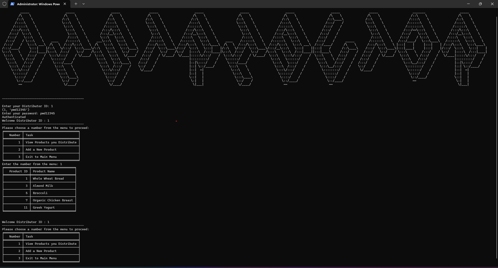

# 🛒 Online Retail Store Management System

A **command-line interface (CLI)** based management system for an online retail store. This system empowers **Administrators**, **Customers**, **Distributors**, and **NGOs** to manage and participate in retail operations efficiently.

Built with **Python** and backed by a **MySQL** database, this project showcases a comprehensive simulation of inventory control, sales tracking, user engagement, and distribution management.

---

## 🚀 Features

### 👩‍💼 Admin Panel

Admins have full control over the store’s backend operations, including inventory, order management, customer tracking, and performance analysis.

* 📈 View **Quarterly Sales** per product category
* 🗃️ View **Curated Sales Data** for deeper insights
* 🥇 Identify **Top 5 Customers** based on total spending
* 📦 Inspect **Inventory by Storage Type**
* ➕ **Add & View Categories** to expand the product base
* 🚚 View **Top 10 Delivery Partners' Ratings & Wages**
* 📋 Track **Incomplete Orders and Their Status**
* 🔧 **Modify Inventory Quantities** and manage product availability
* 📤 **Assign Delivery Partners** to pending orders
* 🛒 **Add or Remove Products** from inventory
* 🧪 **Run Automated Tests** for validation of the order and inventory modules

### 🧍 Customer Dashboard

Customers can seamlessly explore, purchase, and track their orders.

* 🛍️ **Add Products to Cart**
* 👀 **View Cart Contents**
* 💳 **Checkout with Donations** to NGOs
* 📜 **Track Order History** and status updates

### 🏢 Distributor Access

Distributors can manage the products they supply.

* 📋 **View Distributed Products**
* ➕ **Add New Products** for distribution

### 🧡 NGO Insights

A transparent display of partnered NGOs.

* 🔍 View **NGO ID, Name, Registration No., and Funds Raised**

---

## 🧑‍💻 Contributing Team

* **Vipul Mishra**
* **Namit Jain**
* **Ayush Singhal**

---

## 🛠️ Installation Guide

### Step 1: Clone the Repository

```bash
git clone https://github.com/namit22315/ONLINE-STORE-MANAGEMENT.git
cd ONLINE-STORE-MANAGEMENT
```

### Step 2: Install Python Dependencies

```bash
pip install mysql.connector tabulate tqdm
```

### Step 3: Set Up MySQL Database

1. Create a MySQL database named:

   ```
   online retail store
   ```
2. Import the provided SQL schema to generate necessary tables.

### Step 4: Configure Database Credentials

Open `CLI.py` and update your MySQL credentials:

```python
cnx = mysql.connector.connect(
    user='your_username',
    password='your_password',
    host='localhost',
    port='3306',
    database='online retail store'
)
```

---

## ▶️ Running the Application

```bash
python CLI.py
```

Follow the interactive CLI prompts to log in as Admin, Customer, Distributor, or explore NGO data.

---

## 📁 Project Structure

```plaintext
ONLINE-STORE-MANAGEMENT/
│
├── Admin/                  # Admin-related functions and modules
├── ScreenShots/           # Interface screenshots for reference
├── CLI.py                 # Main interface script
├── order_fixer.py         # Order correction logic
├── check_products.py      # Product validation module
└── README.md              # This file
```

---

## 📚 Documentation

Code is well-documented with **inline comments** and **docstrings** explaining the purpose and usage of each function and module. Start with `CLI.py` for a top-down understanding.

---

## 🧩 Dependencies

| Package           | Description                    |
| ----------------- | ------------------------------ |
| `mysql.connector` | Python-MySQL interface         |
| `tabulate`        | Tabular display for CLI tables |
| `tqdm`            | CLI-based progress bars        |

---

## 🔗 GitHub Repository

[🔗 ONLINE-STORE-MANAGEMENT (GitHub)](https://github.com/namit22315/ONLINE-STORE-MANAGEMENT)

---

## 📸 Screenshots

| Interface                 | Screenshot                                       |
| ------------------------- | ------------------------------------------------ |
| **Main Menu**             |           |
| **Admin Menu**            |         |
| **Customer Dashboard**    |           |
| **Shopping Cart**         |                |
| **Payment Screen**        |        |
| **Distributor Dashboard** |  |

---

## 🤝 Future Improvements (Suggestions)

* Web-based GUI using Flask/Django
* Integration with payment gateways
* Advanced analytics dashboards
* Role-based access with authentication layers
* Real-time inventory alerts via email/SMS

---
